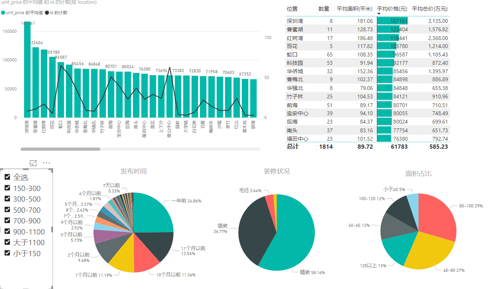
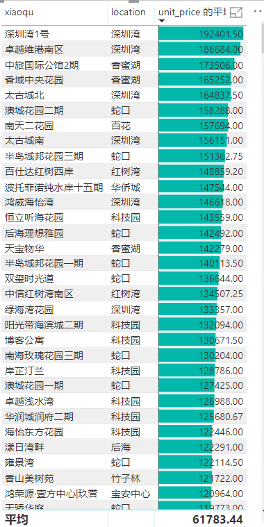
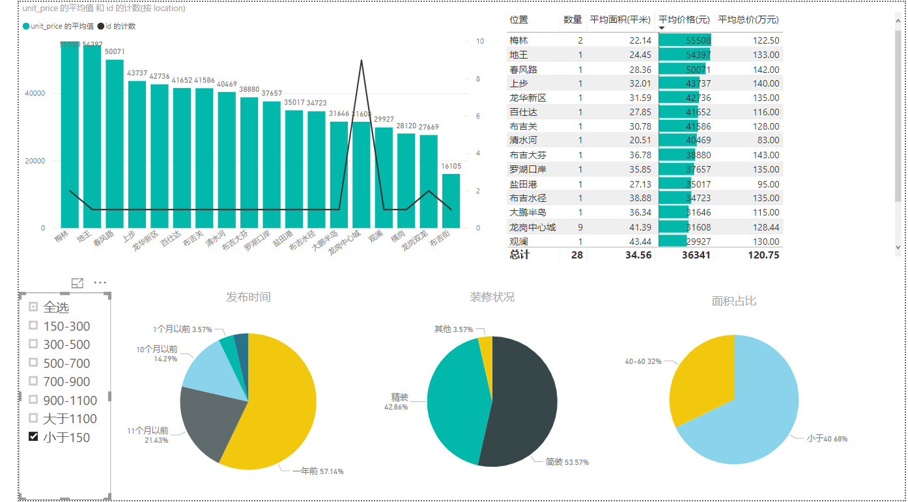
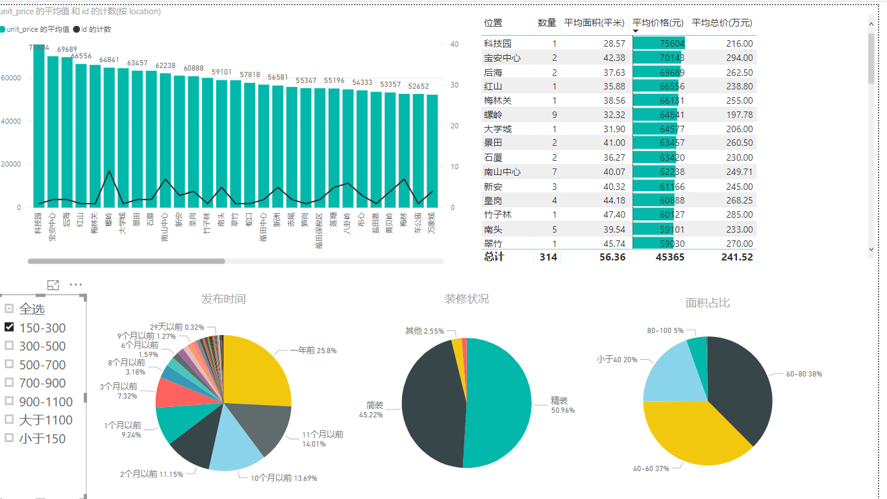
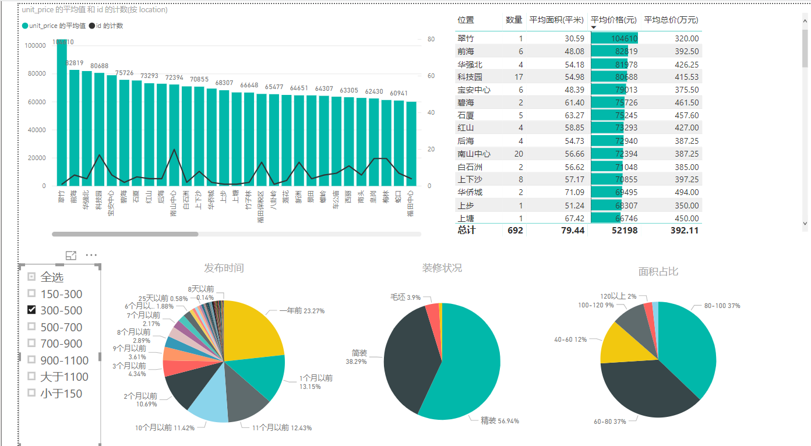
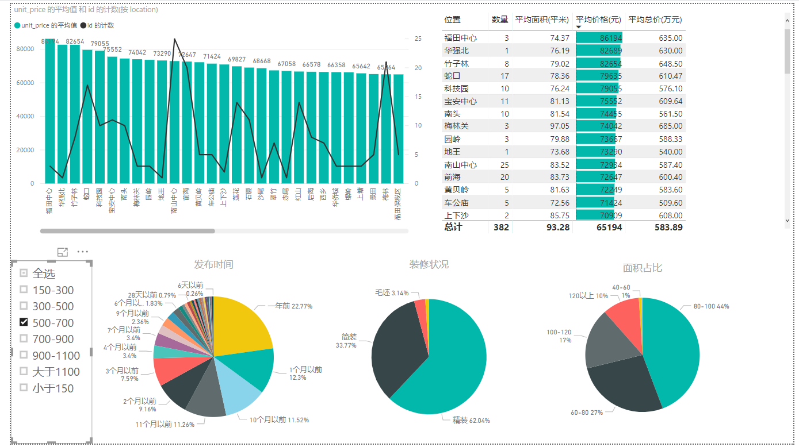
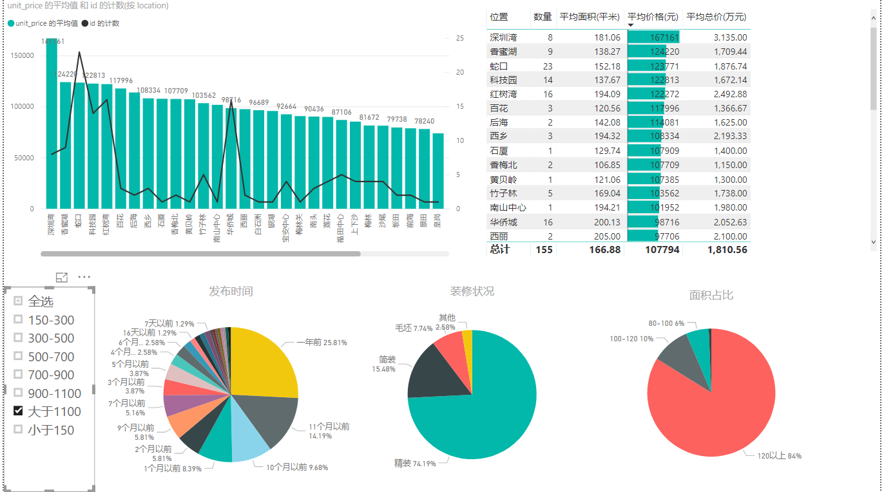

# scrapy_lianjia_ershoufang
链家二手房python爬虫，抓取二手房100页的数据

**运行**  
```
cd scrapy_lianjia_ershoufang
scrapy crawl ErshoufangSpider -a city=城市名首字母，可在链家网查询
```

**数据**

[成都数据](data/ErshoufangSpider_cd.csv)

[广州数据](data/ErshoufangSpider_gz.csv)

[杭州数据](data/ErshoufangSpider_hz.csv)

[上海数据](data/ErshoufangSpider_sh.csv)

[深圳数据](data/ErshoufangSpider_sz.csv)

**简单分析**以深圳为例

全部



最土豪的小区



总价低于150w的



150-300w的



300-500w的



500-700w的



大于1100w的



